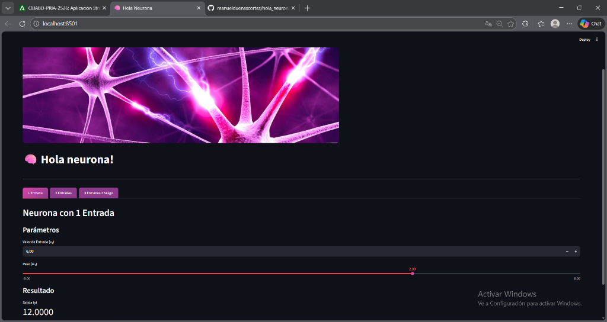
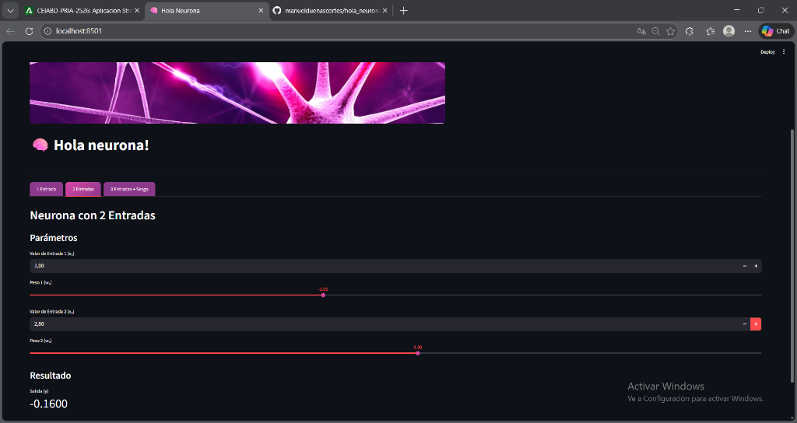
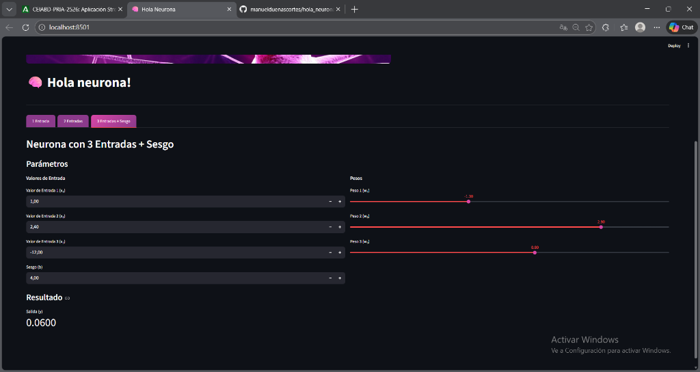

# Hola Neurona

Aplicación de Streamlit que simula neuronas artificiales con diferentes configuraciones.

## Descripción

Esta aplicación implementa tres ejemplos de neuronas:
- Neurona con 1 entrada
- Neurona con 2 entradas
- Neurona con 3 entradas + sesgo

## Capturas de pantalla

### Neurona con 1 Entrada


### Neurona con 2 Entradas


### Neurona con 3 Entradas + Sesgo


## Ejecutar localmente

```bash
pip install -r requirements.txt
streamlit run app.py
```

## Ejecutar con Docker

```bash
docker-compose up
```

La aplicación estará disponible en `http://localhost:8501`
